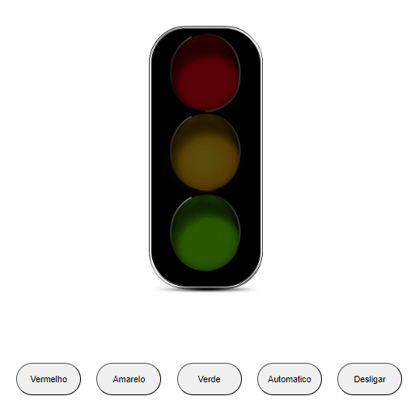

# Mini Projetos JavaScript (Iniciante)

> Este repositório serve como um espaço para armazenar os mini projetos que aprendi com as aulas no canal do @fernandoleonid enquanto estou estudando JavaScript. Cada projeto representa uma oportunidade de praticar conceitos fundamentais da linguagem e explorar diferentes áreas de aplicação.

## Sobre os Projetos

Os projetos neste repositório são resultados do meu processo de aprendizado em JavaScript. Eles podem variar em complexidade e finalidade, desde exercícios simples até pequenos aplicativos práticos.

## Como Navegar

Sinta-se à vontade para explorar os projetos neste repositório. Você pode examinar o código-fonte, experimentar os aplicativos e até mesmo sugerir melhorias se desejar.

## Lista de Projetos

>O projeto ainda está em desenvolvimento e as próximas atualizações serão voltadas nas seguintes tarefas:

- [x] 1. **Calculadora IMC**: Uma calculadora simples para calcular o indice IMC de uma pessoa.
      <li><a href="./01%20-%20CALCULADORA%20IMC/">Código</a></li>
      

      
      

- [x] 2. **Lampada 1**: Uma aplicação simples para acender, apagar e trocar uma lampada, com uma função que quebra ela caso dê 2 cliques na mesma.
      <li><a href="./02%20-%20LAMPADA%2001/">Código</a></li>
      

      
      

- [x] 3. **Lampada 2**: Diferente da lampada 1, esta tem apenas dois botões, sendo um deles para trocar e o outro com dupla funcionalidade.
      <li><a href="./03%20-%20LAMPADA%2002/">Código</a></li>
      

      
      

- [x] 4. **Semaforo**: Um esquema de semaforo, com funções manuais de troca de cores, uma automatica e uma opção de desligar.
      <li><a href="./main/04%20-%20SEMAFOROC/">Código</a></li>
      

      
      

## Contribuindo

Este repositório é uma coleção pessoal de projetos de aprendizado, mas se você tiver sugestões ou feedback sobre qualquer um dos projetos, fique à vontade para compartilhar através das issues.

Divirta-se explorando os projetos e acompanhando minha jornada de aprendizado em JavaScript!
